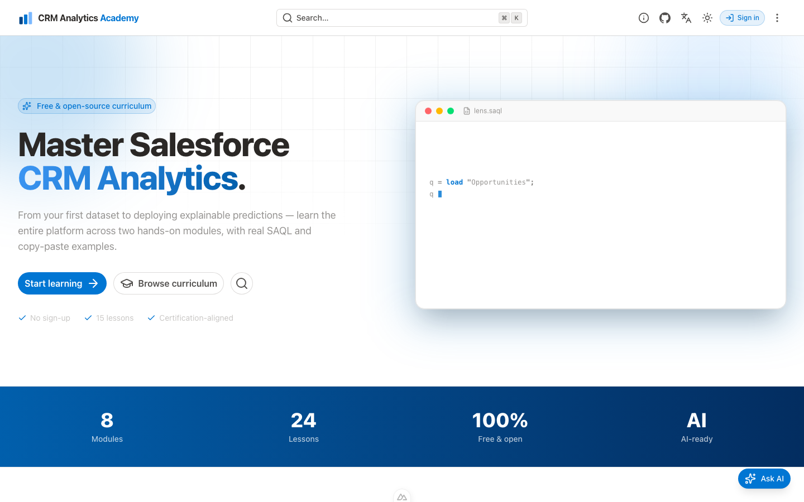

<h1 align="center">CRM Analytics Academy</h1>

<p align="center">
  A free, open-source curriculum for mastering <strong>Salesforce CRM Analytics</strong> —
  data prep, SAQL, dashboards, bindings, and Einstein Discovery — with an AI tutor,
  member accounts, progress tracking, quizzes, and a community showcase.
</p>

<p align="center">
  <a href="https://crmanalytics.imswarnil.com"><strong>🌐 Live site</strong></a> ·
  <a href="https://crmanalytics.imswarnil.com/contribute"><strong>🤝 Contribute</strong></a>
</p>

<p align="center">
  
  
  
  
  
</p>

<p align="center">
  
</p>

## Features

- 📚 **Content-driven curriculum** — lessons are Markdown under `content/`, organised into modules, in **8 languages**.
- 🤖 **AI tutor ("CRM Analytics AI")** — a docs-grounded chat (floating + inline per lesson). **Bring your own key**: each visitor can pick a provider (Gemini, OpenAI, Claude, Groq, OpenRouter), model, and paste their own API key.
- 👤 **Member accounts** — Google sign-in via Supabase, with profiles and a personal dashboard.
- ✅ **Progress tracking** — mark lessons complete and take end-of-lesson **quizzes**; results saved per user.
- 🔒 **Members-only lessons** — opt-in soft gate via lesson frontmatter.
- 🌍 **Community** — users submit **resources** and **projects** (dashboards) that appear on the site once an **admin** approves them, plus per-lesson **comments**.
- 🧩 **Machine-readable** — every page is available as raw Markdown (`/raw/…`), an `llms.txt`, and MCP tools for AI agents.
- ⚡ **Fast & SEO-friendly** — SSR + prerendering on Vercel, OG images, structured data, and AdSense slots.

## Tech stack

| Area | Choice |
|------|--------|
| Framework | **Nuxt 4** (Vue 3, Nitro) |
| Content | **@nuxt/content 3** (Markdown, SQLite) |
| UI | **Nuxt UI v4** + **Tailwind CSS 4** |
| Auth & data | **Supabase** (Postgres + Row-Level Security), Google OAuth |
| AI | Multi-provider streaming (Gemini / OpenAI / Groq / OpenRouter / Anthropic) |
| i18n | **@nuxtjs/i18n** (8 locales) |
| Hosting | **Vercel** |

## Quick start

Requires **Node.js 20+** and **pnpm**.

```bash
git clone https://github.com/imswarnil/CRM-Analytics-Academy.git
cd CRM-Analytics-Academy
pnpm install
cp .env.example .env      # then fill in the values below
pnpm dev                  # → http://localhost:3000
```

Verify before committing (there's no test runner):

```bash
pnpm lint
pnpm typecheck
```

> **Tip:** if the docs sidebar looks empty in dev, the local content DB went stale — run `rm -rf .data && pnpm dev`.

## Environment variables

Copy `.env.example` to `.env` (gitignored) and set:

| Variable | Purpose |
|----------|---------|
| `NUXT_GEMINI_API_KEY` | Optional default AI key (server-only). Visitors can also bring their own key. |
| `CRMA_SUPABASE_URL` | Supabase project URL (public). |
| `CRMA_SUPABASE_ANON_KEY` | Supabase anon key (public, browser client). |
| `CRMA_SUPABASE_SERVICE_ROLE_KEY` | Supabase service-role key (server-only; admin/moderation). |

On Vercel, set the same variables in **Project → Settings → Environment Variables**.

## Database setup (Supabase)

The schema lives in `supabase/migrations/`. Apply it with the [Supabase CLI](https://supabase.com/docs/guides/cli):

```bash
supabase login
supabase link --project-ref <your-project-ref>
supabase db push
```

Then make yourself admin (after signing in once):

```sql
update public.profiles set role = 'admin'
where id = (select id from auth.users where email = 'you@example.com');
```

Enable **Google** under Supabase → Auth → Providers, and add your app URLs (including `…/confirm`) under Auth → URL Configuration. Every table ships with Row-Level Security.

## Project structure

```
content/                 Lessons (Markdown), per locale → per module
app/
  pages/                 Routes incl. the [...slug] catch-all for docs
  components/            Chat, comments, quiz, progress, gating, header…
  composables/           useDb, useProfile, useAiSettings, useDocsChat
  middleware/auth.ts     Per-page auth guard
server/
  api/chat.post.ts       Multi-provider AI chat (retrieval + streaming)
  api/admin/             Admin moderation (service-role, guarded)
  utils/llm.ts           Provider streaming (Gemini/OpenAI/Groq/…)
supabase/migrations/     Idempotent SQL schema + RLS
types/database.types.ts  Typed Supabase client
```

## Contributing

Contributions are welcome — add a lesson, translate content, submit a resource/project, or improve the code. See the full guide at **[/contribute](https://crmanalytics.imswarnil.com/contribute)**.

## License

[MIT](./LICENSE) © Swarnil Singhai
