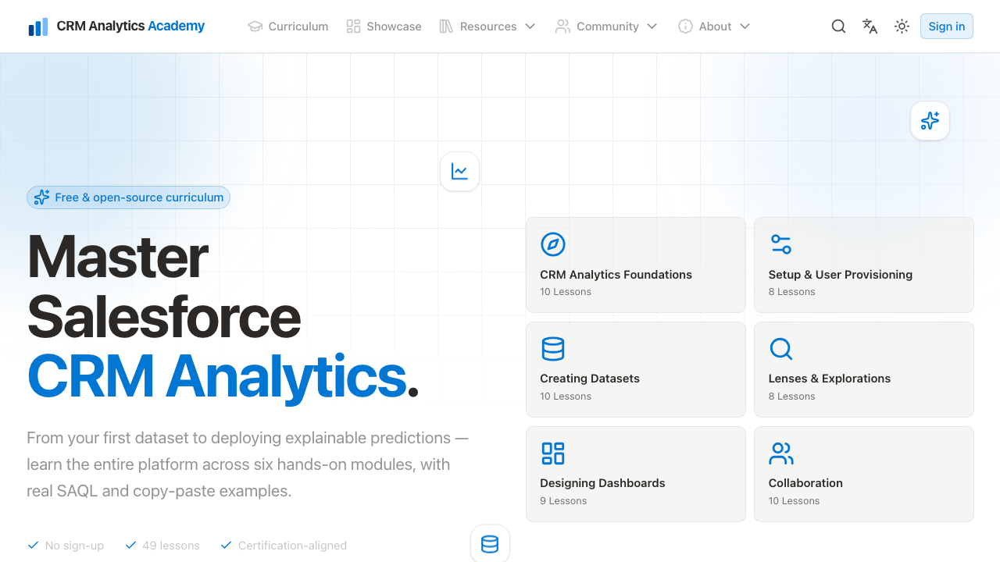

<h1 align="center">CRM Analytics Academy</h1>

<p align="center">
  A free, open-source curriculum for mastering <strong>Salesforce CRM Analytics</strong> —
  data prep, SAQL, dashboards, bindings, and Einstein Discovery.
</p>

<p align="center">
  <a href="https://crmanalytics.imswarnil.com"><strong>🌐 Live site</strong></a> ·
  <a href="https://crmanalytics.imswarnil.com/foundations"><strong>📚 Start learning</strong></a> ·
  <a href="https://crmanalytics.imswarnil.com/wall-of-fame"><strong>🏆 Wall of Fame</strong></a> ·
  <a href="https://crmanalytics.imswarnil.com/contribute"><strong>🤝 Contribute</strong></a>
</p>

<p align="center">
  <a href="https://github.com/imswarnil/CRM-Analytics-Academy/actions/workflows/deploy-cloudflare.yml"></a>
  
  
  
  
  
  
</p>

<p align="center">
  
</p>

## Why this exists

Salesforce CRM Analytics (formerly Wave / Einstein Analytics / Tableau CRM) is
well documented in pieces and poorly documented as a path. This is the path:
six sections that go from "what is a dataset" to shipping a faceted dashboard
and talking about it in an interview — free, open source, in twelve languages.

## The curriculum

| # | Section | Covers |
|---|---------|--------|
| 1 | [Foundations](https://crmanalytics.imswarnil.com/foundations) | What CRM Analytics is, how data becomes a secure dataset, the platform's building blocks |
| 2 | [Setup & User Provisioning](https://crmanalytics.imswarnil.com/setup) | Licences, permission sets, the Integration and Security users, row-level predicates |
| 3 | [Creating Datasets](https://crmanalytics.imswarnil.com/creating-datasets) | Grain, lookups vs joins, Dataset Builder, recipes, the sync layer |
| 4 | [Lenses & Explorations](https://crmanalytics.imswarnil.com/lenses-and-explorations) | Explorer mode, SAQL behind a chart, the Fields panel, Conversational Analytics |
| 5 | [Designing Dashboards](https://crmanalytics.imswarnil.com/designing-dashboards) | Faceting, conditional formatting, KPI rows, links that carry filters |
| 6 | [Collaboration](https://crmanalytics.imswarnil.com/collaboration) | Sharing, subscriptions, notifications, watchlists, driving adoption |

Each section is video-led — lessons pair a clip from a real training session
with a written article — and closes with an interview-prep study sheet.

## Features

- 📚 **Content-driven curriculum** — 49 lessons as Markdown under `content/`, prerendered in every language.
- 🌍 **12 locales** — `en` `es` `fr` `de` `pt` `ja` `zh` `hi` `ar` `ru` `bn` `ur`, with `ar`/`ur` right-to-left. English is the source; the other eleven are machine-translated by a LibreTranslate pipeline (`pnpm translate` locally, a GitHub Action in CI). An untranslated page falls back to English at its localized URL rather than 404ing.
- 👤 **Accounts & progress** — email/password sign-in (Neon Auth), lesson completion tracking, a learner dashboard and a points leaderboard. The curriculum itself never requires an account.
- 🏆 **Community surfaces** — a [Wall of Fame](https://crmanalytics.imswarnil.com/wall-of-fame) honoring the bloggers, authors and tool builders who taught the ecosystem; a filterable directory of [companies and consultancies](https://crmanalytics.imswarnil.com/companies) on CRM Analytics; and [job listings](https://crmanalytics.imswarnil.com/jobs) refreshed daily from public job boards.
- 📝 **Submissions** — a multi-step wizard for sharing resources and dashboards, with screenshot uploads to R2 and a human moderation queue behind an admin console.
- 🎬 **Video-led lessons** — click-to-play embeds; no player script loads until asked for.
- 💬 **Interview prep** — model Q&A per section, also emitted as `FAQPage` structured data.
- 🖼️ **Dashboard showcase** — community build write-ups: screenshot, the KPIs with the formula behind each, the build recipe, and technique filters.
- 🧩 **Machine-readable** — every page as raw Markdown at `/raw/…`, plus `llms.txt` for AI agents.
- ⚡ **Static-first** — every lesson in every language is prerendered and served from the edge; the Worker only wakes for the signed-in surface and `/api/*`.

## Tech stack

| Area | Choice |
|------|--------|
| Framework | **Nuxt 4** (Vue 3, Nitro) |
| Content | **@nuxt/content 3** (Markdown, SQLite at build time) |
| UI | **Nuxt UI v4** + **Tailwind CSS 4** |
| i18n | **@nuxtjs/i18n** (12 locales) + LibreTranslate pipeline |
| Auth & data | **Neon Postgres** + **Neon Auth** (better-auth) |
| Media | **Cloudflare R2** (screenshots, lesson media) |
| SEO | `nuxt-og-image`, `nuxt-llms`, JSON-LD structured data |
| Hosting | **Cloudflare Workers** (static assets + a small dynamic Worker), deployed by GitHub Actions |

## Quick start

Requires **Node.js 22.5+** (the content layer uses `node:sqlite`) and **pnpm**.

```bash
git clone https://github.com/imswarnil/CRM-Analytics-Academy.git
cd CRM-Analytics-Academy
pnpm install
pnpm dev                  # → http://localhost:3000
```

The curriculum, showcase and every static page work with no configuration.
Auth, progress and uploads need the environment variables below; without
them those surfaces degrade gracefully.

Verify before committing (there's no test runner):

```bash
pnpm lint
pnpm typecheck
pnpm build                # catches SSR/prerender issues dev mode doesn't
```

> **Tip:** if the docs sidebar looks empty in dev, the local content DB went stale — run `rm -rf .data && pnpm dev`.

## Environment variables

Copy `.env.example` to `.env` (gitignored). All are optional for working on
content; the dynamic layer needs the Neon ones.

| Variable | Purpose |
|----------|---------|
| `NUXT_PUBLIC_SITE_URL` | Public site URL, used for OG images when prerendering. |
| `DATABASE_URL` | Neon pooled connection string (progress, submissions, roles). |
| `NEON_AUTH_BASE_URL` / `NEON_AUTH_COOKIE_SECRET` | Neon Auth (managed better-auth) endpoint and cookie secret. |
| `ADMIN_EMAILS` | Comma-separated bootstrap admin allowlist. |
| `LIBRETRANSLATE_URL` | Translation server for `pnpm translate`. |
| `ADZUNA_APP_ID` / `ADZUNA_APP_KEY` | Optional; enriches the daily jobs refresh. |

## Project structure

```
content/                 Lessons (Markdown), per locale → per section
  showcase/              Community dashboard write-ups (not localized)
app/
  pages/                 Routes incl. the [...slug] catch-all for docs
  components/            Header, footer, hero, ads, MDC content components
  composables/           Auth, progress, course, ad slots, JSON-LD
  data/jobs.json         Jobs dataset, refreshed daily by a workflow
server/
  api/                   Auth proxy, progress, submissions, uploads, admin
  routes/raw/            Any page as raw Markdown, for AI agents
  routes/media/          R2-backed media (screenshots)
  db/                    SQL schema for the Neon database
scripts/                 Translation pipeline, jobs fetcher, content gating
.github/workflows/       Cloudflare deploy, translation, daily jobs refresh
```

## Adding a lesson

Add a Markdown file — never a `.vue` file:

```
content/en/<NN.section>/<NN.lesson>.md
```

Numeric prefixes set the ordering; `.navigation.yml` in each section folder sets
its sidebar title and icon. New pages must be link-reachable from `/` to be
prerendered. Push to `main` and the pipeline translates and deploys.

## Deployment

Every push to `main` runs lint + typecheck, builds, and deploys to Cloudflare
Workers (`.github/workflows/deploy-cloudflare.yml`). The whole curriculum is
prerendered and served as static assets from the edge; requests with no
matching file — `/api/*`, the signed-in pages — fall through to the Worker.
A manual-dispatch GitHub Pages workflow remains as a documented static-only
rollback path.

## Contributing

Contributions are welcome — add a lesson, translate content, suggest a resource,
or improve the code. See the full guide at
**[/contribute](https://crmanalytics.imswarnil.com/contribute)**, or submit a
resource directly at **[/submit](https://crmanalytics.imswarnil.com/submit)**.

## License

[MIT](./LICENSE) © Swarnil Singhai
