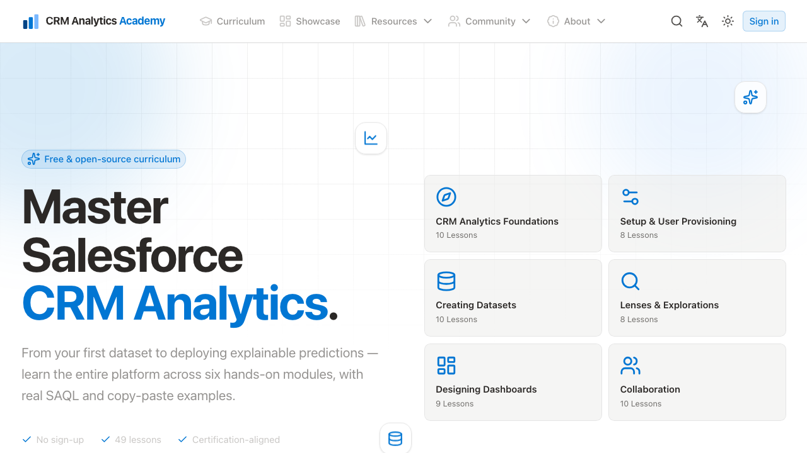
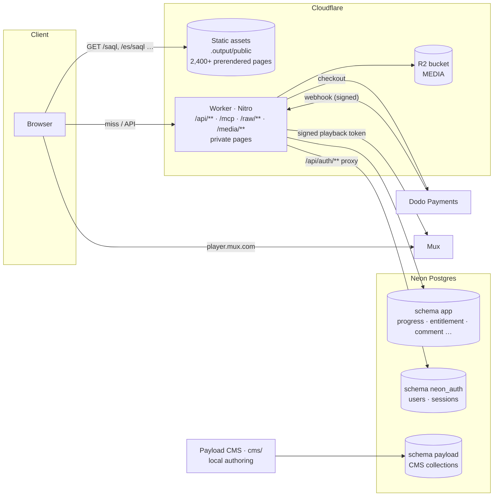
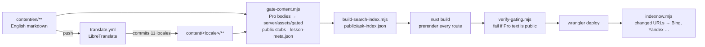
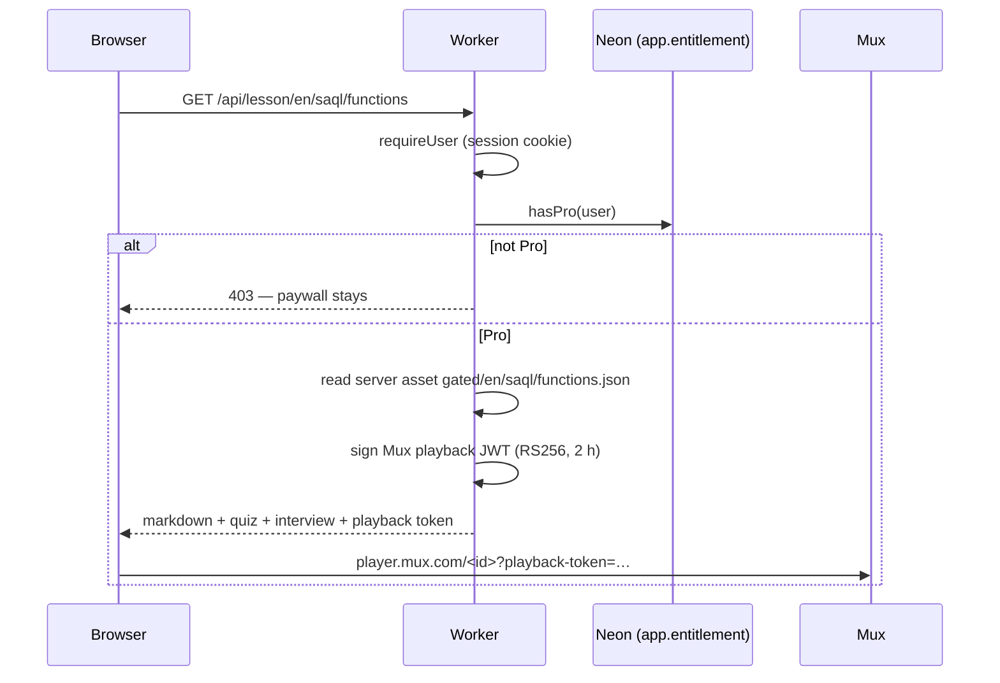
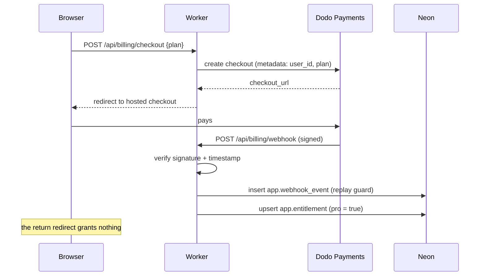
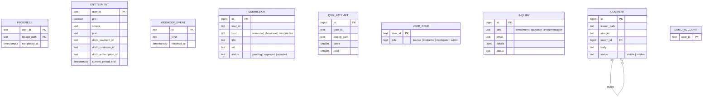

<p align="center"></p>

<h1 align="center">CRM Analytics Academy</h1>

<p align="center">
  <strong>The free, open-source course for Salesforce CRM Analytics</strong> — data prep, datasets, SAQL,
  dashboards, bindings, Einstein Discovery and seventeen go-to-market dashboard builds, in twelve languages.
</p>

<p align="center">
  <a href="https://crmanalytics.imswarnil.com"><strong>Live site</strong></a> ·
  <a href="https://crmanalytics.imswarnil.com/curriculum"><strong>Curriculum</strong></a> ·
  <a href="https://crmanalytics.imswarnil.com/introduction"><strong>Start lesson 1</strong></a> ·
  <a href="https://crmanalytics.imswarnil.com/contribute"><strong>Contribute</strong></a>
</p>

<p align="center">
  <a href="https://github.com/imswarnil/CRM-Analytics-Academy/actions/workflows/deploy-cloudflare.yml"></a>
  
  
  
  
  <a href="./LICENSE"></a>
</p>

<p align="center">
  
</p>

Salesforce CRM Analytics (formerly Wave, Einstein Analytics and Tableau CRM) is documented well in pieces
and poorly as a path. CRM Analytics Academy is that path: **19 sections and 161 lessons** that go from
"what is a dataset" to security predicates, complex SAQL, bindings, the dashboard JSON underneath, and a full
set of revenue dashboards built on one company's data. The core course is free; optional **Pro** lessons fund it.

---

## Contents

- [Features](#features)
- [Built with](#built-with)
- [Operating the academy](#operating-the-academy)
- [The curriculum](#the-curriculum)
- [Architecture](#architecture)
- [Request flows](#request-flows)
- [Data model](#data-model)
- [API](#api)
- [Content pipeline](#content-pipeline)
- [Internationalisation](#internationalisation)
- [SEO](#seo)
- [CMS (Payload)](#cms-payload)
- [Directory map](#directory-map)
- [Scripts](#scripts)
- [Local setup](#local-setup)
- [Deployment](#deployment)
- [Contributing](#contributing)
- [License](#license)

## Features

- **161 lessons in 19 sections**, prerendered in **12 languages** (2,400+ static pages).
- **Lesson player** — course contents sidebar with progress rings, prev / mark complete / next, a course
  timeline, collapsible table of contents, screen walkthroughs, graded quizzes and interview Q&A.
- **Accounts and progress** (Neon Auth), points, a leaderboard, comments on every lesson, a demo account.
- **Pro lessons** — the body of a Pro lesson never ships in the static bundle; it is served after a
  server-side entitlement check. Payments through **Dodo Payments**; video through **Mux** (signed for Pro).
- **Community** — submit resources, dashboards and lesson ideas; moderated in `/admin`; a showcase of
  dashboard write-ups with KPIs, formulas and build recipes.
- **Business pages** — team quotations, classroom enrolment and implementation enquiries into one inbox.
- **AI-ready** — any lesson as raw markdown at `/raw/<path>.md`, an `llms.txt`, a search page (`/ask`) and a
  read-only **MCP server** at `/mcp` (`list_curriculum`, `search_lessons`, `get_lesson`).
- **Blueprint design system** — paper/ink tokens, graph paper, crop marks, hard shadows, mono labels
  (spec in [`docs/design-handoff-blueprint/`](./docs/design-handoff-blueprint)).
- **Payload CMS** for authoring, written back to markdown so git stays the source of truth.

## Built with

| Layer | Technology |
| --- | --- |
| Framework | [Nuxt 4](https://nuxt.com) (Vue 3, Vite, Nitro), TypeScript |
| Content | [Nuxt Content 3](https://content.nuxt.com) (markdown + MDC components), `nuxt-llms` for `llms.txt`, `/raw/*.md` for agents |
| UI | [Nuxt UI v4](https://ui.nuxt.com), [Tailwind CSS 4](https://tailwindcss.com), the in-house **Blueprint** design system (graph paper, crop marks, hard shadows), Schibsted Grotesk + IBM Plex Mono via `@nuxt/fonts`, Lucide / Simple Icons via Iconify |
| i18n | `@nuxtjs/i18n` — 12 locales, 2 RTL; machine translation through a self-hosted [LibreTranslate](https://libretranslate.com) |
| Hosting | [Cloudflare Workers](https://workers.cloudflare.com) (static assets at the edge + a Nitro Worker), Cloudflare R2 for uploads, Wrangler |
| Database | [Neon](https://neon.tech) serverless Postgres (`@neondatabase/serverless`) |
| Auth | Neon Auth ([better-auth](https://better-auth.com)), a shared demo account |
| Payments | [Dodo Payments](https://dodopayments.com) hosted checkout + Standard Webhooks (test mode) |
| Video | [Mux](https://mux.com) (public + signed playback, per-language ids), Mux CLI for uploads, ffmpeg + VoiceStudio / macOS voices for local narration |
| CMS | [Payload 3](https://payloadcms.com) on Next.js 15 (`cms/`), Postgres adapter in its own schema, optional R2 storage; Nuxt Studio as a lightweight in-browser editor |
| Automation | [n8n](https://n8n.io) webhook → Salesforce Lead (HMAC-signed), enrichment from the company's own site |
| SEO | `@nuxtjs/sitemap`, `nuxt-og-image` (Takumi renderer), JSON-LD per page type, hreflang, IndexNow |
| Analytics | Microsoft Clarity |
| PWA | Web app manifest, service worker with an offline page, install prompt |
| Creative | `content-assets/` — SVG/PNG/ProRes kit, After Effects ExtendScript, Premiere XML, lesson-slide generator (rsvg-convert, ffmpeg) |
| Quality | ESLint (`@nuxt/eslint`), `vue-tsc` typecheck, a build-time gating verifier, GitHub Actions, Renovate |

## Operating the academy

The full, step-by-step operator's guide lives in the admin console (**/admin → Guide**). In short:

1. **Write** a lesson in Payload (`pnpm cms:dev`) or as `content/en/<NN.section>/<NN.lesson>.md`; preview with `pnpm dev`.
2. **Free or Pro**: `access: pro` in the English frontmatter, the Payload field, or **/admin → Lessons & Pro**. The build gates the body and fails if anything leaks.
3. **Video**: `pnpm mux:lesson <route> <file> [--lang=es]`; slides for recording with `pnpm slides:lesson <route>`; edit in After Effects / Premiere from `content-assets/`.
4. **Publish**: `pnpm cms:pull`, commit, push — translation, build, deploy and IndexNow run in GitHub Actions.
5. **Sell**: individuals buy Pro on `/pricing`; companies buy seats on `/teams` and invite colleagues on `/team`; bigger deals come through `/sales`.
6. **Leads**: every form (sales, quotes, training, implementation, sponsor, instructor, nomination, contact) lands in Neon, is enriched, forwarded to Salesforce through n8n, and worked in **/admin → Leads**.
7. **Track**: `/admin` KPIs, Clarity, Search Console, the Dodo dashboard and the GitHub Actions runs.

## The curriculum

| # | Section | Lessons |
|---|---|---|
| 00 | [Introduction](https://crmanalytics.imswarnil.com/introduction) | 8 |
| 01 | [CRM Analytics Basics](https://crmanalytics.imswarnil.com/foundations) | 9 |
| 02 | [Setup, Profiles & Security](https://crmanalytics.imswarnil.com/setup) | 9 |
| 03 | [Data Preparation](https://crmanalytics.imswarnil.com/data-preparation) | 11 |
| 04 | [Datasets & Modelling](https://crmanalytics.imswarnil.com/datasets-and-modelling) | 8 |
| 05 | [Data Visualization](https://crmanalytics.imswarnil.com/data-visualization) | 13 |
| 06 | [Lenses & Exploration](https://crmanalytics.imswarnil.com/lenses-and-explorations) | 6 |
| 07 | [SAQL](https://crmanalytics.imswarnil.com/saql) | 9 |
| 08 | [Dashboard Design & UI](https://crmanalytics.imswarnil.com/designing-dashboards) | 8 |
| 09 | [Interactions & Faceting](https://crmanalytics.imswarnil.com/interactions) | 6 |
| 10 | [Bindings](https://crmanalytics.imswarnil.com/bindings) | 7 |
| 11 | [Dashboard JSON](https://crmanalytics.imswarnil.com/dashboard-json) | 7 |
| 12 | [Collaboration & Embedding](https://crmanalytics.imswarnil.com/collaboration) | 9 |
| 13 | [APIs & Automation](https://crmanalytics.imswarnil.com/apis-and-automation) | 8 |
| 14 | [Einstein Discovery](https://crmanalytics.imswarnil.com/einstein-discovery) | 8 |
| 15 | [GTM Engineering](https://crmanalytics.imswarnil.com/gtm-engineering) | 9 |
| 16 | [Demand Analytics](https://crmanalytics.imswarnil.com/demand-analytics) | 9 |
| 17 | [Pipeline Analytics](https://crmanalytics.imswarnil.com/pipeline-analytics) | 10 |
| 18 | [RevOps & Retention](https://crmanalytics.imswarnil.com/revops-analytics) | 7 |

## Architecture

**Static-first.** Every public page is prerendered at build time and served by Cloudflare straight from the
edge; the Worker (Nitro, `cloudflare_module` preset) only runs for requests that miss a static file — the
API, auth, and private pages. The reading experience never touches the database.


```mermaid
flowchart LR
  subgraph Client
    B[Browser]
  end

  subgraph Cloudflare
    A[(Static assets<br/>.output/public<br/>2,400+ prerendered pages)]
    W[Worker · Nitro<br/>/api/** · /mcp · /raw/** · /media/**<br/>private pages]
    R2[(R2 bucket<br/>MEDIA)]
  end

  subgraph Neon Postgres
    APP[(schema app<br/>progress · entitlement · comment …)]
    AUTH[(schema neon_auth<br/>users · sessions)]
    PL[(schema payload<br/>CMS collections)]
  end

  B -- "GET /saql, /es/saql …" --> A
  B -- "miss / API" --> W
  W --> APP
  W -- "/api/auth/** proxy" --> AUTH
  W --> R2
  W -- "checkout" --> DODO[Dodo Payments]
  DODO -- "webhook (signed)" --> W
  W -- "signed playback token" --> MUX[Mux]
  B -- "player.mux.com" --> MUX
  CMS[Payload CMS · cms/<br/>local authoring] --> PL
```

**Build and deploy pipeline** (GitHub Actions):


```mermaid
flowchart LR
  EN[content/en/**<br/>English markdown] -->|push| TR[translate.yml<br/>LibreTranslate]
  TR -->|commits 11 locales| C[content/&lt;locale&gt;/**]
  EN --> G
  C --> G[gate-content.mjs<br/>Pro bodies → server/assets/gated<br/>public stubs · lesson-meta.json]
  G --> IDX[build-search-index.mjs<br/>public/ask-index.json]
  IDX --> NB[nuxt build<br/>prerender every route]
  NB --> VG[verify-gating.mjs<br/>fail if Pro text is public]
  VG --> WD[wrangler deploy]
  WD --> IN[indexnow.mjs<br/>changed URLs → Bing, Yandex …]
```

| Layer | Choice |
|---|---|
| Framework | Nuxt 4, Nuxt Content 3, Nuxt UI 4, Tailwind CSS 4 |
| Hosting | Cloudflare Workers — static assets + one Worker (`wrangler.jsonc`) |
| Database | Neon Postgres (`app`, `neon_auth`, `payload` schemas) |
| Auth | Neon Auth (Better Auth), proxied through `/api/auth/**`; resolved server-side per request |
| Payments | Dodo Payments (hosted checkout + Standard Webhooks signature) |
| Video | Mux — public playback for free lessons, RS256-signed tokens for Pro |
| Media | Cloudflare R2 (`MEDIA` binding), served by `/media/**` |
| Translation | LibreTranslate, incremental, driven by `scripts/translate.mjs` |
| CMS | Payload 3 (`cms/`), local authoring, synced to markdown |

## Request flows

**Reading a free lesson** — no Worker, no database:

```mermaid
sequenceDiagram
  participant B as Browser
  participant E as Cloudflare edge
  participant W as Worker
  B->>E: GET /es/saql/functions
  E-->>B: prerendered HTML (+ JSON-LD, hreflang)
  Note over B: hydrates; content comes from the prerendered payload
  B->>W: GET /api/progress (only if signed in)
  W-->>B: completed lessons, points, pro flag
```

**Unlocking a Pro lesson** — the body exists only inside the Worker bundle:


```mermaid
sequenceDiagram
  participant B as Browser
  participant W as Worker
  participant DB as Neon (app.entitlement)
  participant M as Mux
  B->>W: GET /api/lesson/en/saql/functions
  W->>W: requireUser (session cookie)
  W->>DB: hasPro(user)
  alt not Pro
    W-->>B: 403 — paywall stays
  else Pro
    W->>W: read server asset gated/en/saql/functions.json
    W->>W: sign Mux playback JWT (RS256, 2 h)
    W-->>B: markdown + quiz + interview + playback token
    B->>M: player.mux.com/<id>?playback-token=…
  end
```

**Checkout** — the webhook is the only thing that grants Pro:


```mermaid
sequenceDiagram
  participant B as Browser
  participant W as Worker
  participant D as Dodo Payments
  participant DB as Neon
  B->>W: POST /api/billing/checkout {plan}
  W->>D: create checkout (metadata: user_id, plan)
  D-->>W: checkout_url
  W-->>B: redirect to hosted checkout
  B->>D: pays
  D->>W: POST /api/billing/webhook (signed)
  W->>W: verify signature + timestamp
  W->>DB: insert app.webhook_event (replay guard)
  W->>DB: upsert app.entitlement (pro = true)
  Note over B: the return redirect grants nothing
```

## Data model

Application tables live in the `app` schema (`server/db/*.sql`, applied in order). Users themselves live
in `neon_auth`; `app` tables key on the auth `user_id`.


```mermaid
erDiagram
  PROGRESS {
    text user_id PK
    text lesson_path PK
    timestamptz completed_at
  }
  ENTITLEMENT {
    text user_id PK
    boolean pro
    text source
    text plan
    text dodo_payment_id
    text dodo_customer_id
    text dodo_subscription_id
    timestamptz current_period_end
  }
  WEBHOOK_EVENT {
    text id PK
    text kind
    timestamptz received_at
  }
  SUBMISSION {
    bigint id PK
    text user_id
    text kind "resource | showcase | lesson-idea"
    text title
    text url
    text status "pending | approved | rejected"
  }
  QUIZ_ATTEMPT {
    bigint id PK
    text user_id
    text lesson_path
    smallint score
    smallint total
  }
  USER_ROLE {
    text user_id PK
    text role "learner | instructor | moderator | admin"
  }
  INQUIRY {
    bigint id PK
    text kind "enrollment | quotation | implementation"
    text email
    jsonb details
    text status
  }
  COMMENT {
    bigint id PK
    text lesson_path
    text user_id
    bigint parent_id FK
    text body
    text status "visible | hidden"
  }
  DEMO_ACCOUNT {
    text user_id PK
  }
  COMMENT ||--o{ COMMENT : "replies"
```

Views: `app.user_points` (10 per lesson, 2 per best quiz point, plus approved contributions) feeds the
leaderboard; `app.admin_user` joins everything the admin console shows about a user.

## API

| Method | Path | Auth | Purpose |
|---|---|---|---|
| GET | `/api/progress` | user | Completed lessons, points, rank, Pro flag, weekly activity |
| POST | `/api/progress` | user (not demo) | Mark a lesson complete / incomplete |
| POST | `/api/quiz` | user (not demo) | Record a quiz attempt |
| GET | `/api/leaderboard` | public | All-time or last-30-days ranking |
| GET | `/api/lesson/<locale>/<route>` | user + Pro | Full body of a Pro lesson + signed Mux token |
| GET · POST | `/api/comments` | public · user | Read / post comments and one level of replies |
| DELETE | `/api/comments/:id` | author | Delete your own comment (moderators hide via admin) |
| GET · POST | `/api/submissions` | user | Own submissions / submit resource, dashboard, idea |
| POST | `/api/upload` | user | Screenshot upload to R2 |
| POST | `/api/inquiries` | public | Enrolment, quotation or implementation enquiry |
| POST | `/api/newsletter` | public | Newsletter signup (proxied to Ghost members) |
| POST | `/api/billing/checkout` | user (not demo) | Start a Dodo checkout |
| POST | `/api/billing/portal` | user | Billing portal link |
| POST | `/api/billing/webhook` | Dodo signature | Grant / revoke Pro |
| GET | `/api/geo` | public | Visitor country from the edge (first-visit language) |
| * | `/api/auth/**` | — | Proxy to Neon Auth; `POST /api/auth/demo` signs into the demo account |
| GET | `/api/admin/me` | user | Role and permissions of the session |
| GET · PATCH | `/api/admin/submissions`, `/comments`, `/inquiries` | moderator | Moderation queues |
| GET · PATCH · POST | `/api/admin/users` | admin | Users, roles, Pro grants |
| GET · PATCH | `/api/admin/lessons` | admin | Access tier + Mux ids, committed to GitHub |
| GET · PUT | `/api/admin/content/tree`, `/file` | admin · instructor | Course tree from main; read / save a lesson or person (admin → commit to main, instructor → branch + pull request) |
| POST · PATCH | `/api/admin/content/lesson`, `/section` | admin · instructor | Create a lesson or section (next two-digit prefix); rename a lesson; rename a section (admin) |
| POST | `/api/admin/content/reorder` | admin | Reorder lessons or sections: English + every locale + manifest keys, one commit |
| GET · POST | `/api/admin/content/reviews` | admin · instructor | Review queue of instructor pull requests: publish (squash merge), request changes, close |
| GET · PUT | `/api/admin/content/instructors` | admin | Link instructor accounts to people in the registry |
| GET | `/api/admin/stats` | admin | Overview metrics |
| GET | `/raw/<path>.md` | public | Any lesson as raw markdown |
| GET · POST | `/mcp` | public | MCP server (JSON-RPC 2.0), read-only curriculum tools |
| GET | `/media/<key>` | public | Serve an R2 object |

## Content pipeline

`content/<locale>/<NN.section>/<NN.lesson>.md` — two-digit prefixes set the order; `.navigation.yml` per
section sets its title and icon. **Only `content/en/` is written by hand**; the other eleven locales are
generated. Schema: `content.config.ts`.

| Frontmatter | Meaning |
|---|---|
| `title`, `description`, `navigation.title` | Page title, meta description, short sidebar title |
| `access: free \| pro` | Pro bodies are moved out of the public bundle by `gate-content.mjs` |
| `mux: { en: id, es: id }` | Mux playback id per language; English is the fallback |
| `video: { id, start, end, title?, author?, authorUrl? }` | YouTube clip at the top of the lesson; `author` credits someone else's video ("Video by …") |
| `authors: [slug]` | Who wrote it — slugs from `content/people/`; none means the site owner. English only, translations inherit |
| `credits[]: { kind, title, author, authorUrl?, url, license?, note? }` | Third-party video / post / article / image / dataset used in the lesson — "Credits & sources" block and JSON-LD `citation`. English only |
| `walkthrough: { org, shots[] }` | Screen-recording script, rendered as a step-by-step tour and HowTo JSON-LD |
| `quiz[]: { q, options[], answer }` | Graded quiz |
| `interview[]: { q, a }` | Interview Q&A, also FAQPage JSON-LD |
| `links[]` | Buttons in the lesson header |

Collections: `docs` (lessons, all locales), `showcase` (`content/showcase/`, dashboard write-ups),
`resources` (`content/resources/`, curated links) and `people` (`content/people/<slug>.yml` — name, role
instructor | maintainer | blogger | creator | community, avatar, headline, links), listed on `/instructors`
together with everyone named in a lesson's credits.

**Editing in the browser** — `/admin → Content` reads the course from `main` on GitHub (one GraphQL call,
cached per commit) and writes back through the Git Data API: edit a lesson (form + markdown + live preview),
create lessons and sections with correct prefixes, rename, and reorder. A reorder renames the English files,
the same relative paths in every locale and the `.translation-manifest.json` keys in **one commit**, so
nothing is re-translated and no URL changes. Admins commit to `main`; **instructors** (role `instructor`,
linked to a person in the registry) may edit only lessons whose `authors` include them, and every save goes
to a `lesson/<slug>-<id>` branch and pull request that an admin publishes from the review queue. Requires
`GITHUB_CONTENT_TOKEN` with Contents + Pull requests read/write, and migration `012_instructors.sql`.

## Internationalisation

- **12 locales**: `en` (default, unprefixed), `es fr de pt ja zh hi ar ru bn ur`; `ar` and `ur` are RTL.
  Strategy `prefix_except_default` — `/saql` and `/es/saql`.
- UI strings in `i18n/locales/*.json`, English only by hand; `pnpm translate` fills the rest and keeps a
  hash manifest so only changed text is re-translated.
- **First-visit language**: `app/plugins/locale-auto.client.ts` uses the browser's languages, then the
  visitor's country (`/api/geo`) when no browser language is supported. Remembered in a cookie; never
  applied to crawlers, private routes or English-only pages.

## SEO

| Page type | JSON-LD |
|---|---|
| Every page | `Organization` + `EducationalOrganization`, `WebSite` (+ `SearchAction` → `/ask`) |
| Home | `Course` (sections as `hasPart`), `FAQPage` |
| Curriculum | `CollectionPage`, `BreadcrumbList`, `Course` with timed `syllabusSections` |
| Lesson | `TechArticle`, `LearningResource`, `BreadcrumbList`, `HowTo` (walkthrough), `FAQPage` (interview), `VideoObject` (YouTube); translations linked with `workTranslation` / `translationOfWork`; Pro lessons marked `isAccessibleForFree: false` with the gated element |
| Pricing | `Course` with real `Offer`s, `FAQPage` |
| Teams, training, implementation | `Service` |
| Showcase, resources, jobs, leaderboard | `CollectionPage` / `ItemList` |
| Other pages | typed `WebPage` + `BreadcrumbList` (`usePageSchema()`) |

Plus: canonical and `hreflang` (with `x-default`) on every page, a per-locale sitemap index
(`/sitemap_index.xml`), OG images per page, `robots.txt` open to search and AI crawlers, and
**IndexNow** submission of changed URLs after every deploy.

## CMS (Payload)

`cms/` is a Payload 3 app (its own pnpm project; the site's build never installs it). It stores data in the
`payload` schema of the same Neon database and never touches `app` or `neon_auth`. The site never reads
Payload at runtime — content still reaches it as markdown.

```bash
pnpm cms:dev        # http://localhost:3100/admin
pnpm cms:import     # content/ → Payload (upsert on file path)
pnpm cms:pull:dry   # what would change
pnpm cms:pull       # Payload → content/ (rewrites only files whose parsed content changed)
```

Lesson bodies are stored verbatim as markdown so MDC components survive the round trip.

## Directory map

```text
app/
  pages/              index, curriculum, [...slug] (every lesson), pricing, showcase/, dashboard, admin …
  layouts/docs.vue    the lesson player grid (lesson + course contents sidebar)
  components/bp/      Blueprint primitives: PageHeader, Figure, BarChart, Donut, Timeline, CourseContents …
  components/content/ MDC blocks used inside lessons (FieldTable, MetricSpec, FunnelViz …)
  composables/        useCourse, useProgress, useLessonMeta, usePageSchema …
  plugins/            analytics, service worker, first-visit language
  assets/css/main.css Blueprint tokens and utilities
server/
  api/                the routes above
  utils/              auth, admin roles, db, dodo, entitlement, mux signing, memo cache
  db/*.sql            migrations, applied by hand to Neon in order
  routes/             /mcp, /raw/**, /media/**
content/              lessons (12 locales), showcase/, resources/
scripts/              gating, translation, search index, IndexNow, Mux upload, lesson-to-video, jobs
cms/                  Payload CMS
content-assets/       reusable brand, background, video and project images
docs/                 the Blueprint design handoff
.github/workflows/    deploy (Cloudflare), translate, jobs, Pages rollback
```

## Scripts

| Command | What it does |
|---|---|
| `pnpm dev` | Dev server (`http://localhost:3000`), search index first |
| `pnpm build` | Gate Pro content → search index → `nuxt build` (prerender) → verify gating |
| `pnpm preview` | Build, then run the Worker locally with `wrangler dev` |
| `pnpm lint` / `pnpm typecheck` | ESLint / `nuxt typecheck` — the CI gates |
| `pnpm translate` | Translate changed English content and UI strings (`--locales`, `--only`, `--dry-run`) |
| `pnpm gate` | Move Pro lesson bodies into server assets; write `app/data/lesson-meta.json` |
| `pnpm verify:gating` | Fail if any Pro text is in the public bundle |
| `pnpm ask:index` | Build `public/ask-index.json` for `/ask` and the MCP server |
| `pnpm cms:*` | Payload dev / import / pull (see above) |
| `pnpm mux:lesson <lesson> <video> [--lang=es]` | Upload a lesson video to Mux and write its playback id |

## Local setup

Requires Node 22+ and **pnpm** (not npm).

```bash
git clone https://github.com/imswarnil/CRM-Analytics-Academy.git
cd CRM-Analytics-Academy
pnpm install
cp .env.example .env      # only NUXT_PUBLIC_SITE_URL is needed to read lessons
pnpm dev                  # http://localhost:3000
```

The dynamic layer (sign-in, progress, admin, payments) needs the Neon, Neon Auth, Dodo and Mux values
documented in `.env.example`; for `wrangler dev` put them in `.dev.vars`. Without them the curriculum still
renders — only the signed-in features are off.

If the docs sidebar is ever empty in dev, the Nuxt Content dev database is stale:
`rm -rf .data && pnpm dev`.

## Deployment

Push to `main`. `.github/workflows/deploy-cloudflare.yml` runs lint, typecheck, `pnpm build` (with the
gating check) and `wrangler deploy`, then notifies IndexNow. Runtime secrets live on the Worker
(`wrangler secret put …`), never in CI. A push that changes `content/en/**` or `i18n/locales/en.json` also
runs `translate.yml`, which commits the eleven translated locales and triggers another deploy.
`deploy.yml` is a manual, static-only GitHub Pages fallback.

## Contributing

Every lesson is a markdown file — fix a typo with **Edit this page** on any lesson, or add a lesson under
`content/en/` (never a Vue file). New UI strings go in `i18n/locales/en.json` only. Run `pnpm lint` and
`pnpm typecheck` before opening a pull request. The full guide is at
[crmanalytics.imswarnil.com/contribute](https://crmanalytics.imswarnil.com/contribute).

CRM Analytics Academy is an independent project and is not affiliated with Salesforce, Inc.

## License

[MIT](./LICENSE).
